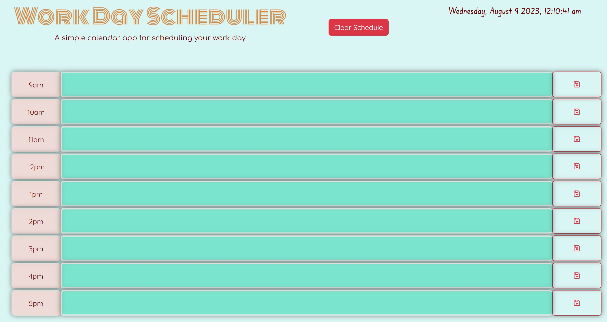

# Work Day Scheduler

## _Interactive Work Day Scheduler Application:_
### _Plan Your Workday Efficiently Against the Clock_

---

## Badges

---
## Description

>This workday scheduler is designed specifically for busy employees. Recognizing the importance of effective time management in today's fast-paced work environment, this tool allows users to seamlessly add essential events to a daily planner. Here's what you can expect:

- **Daily Overview:** As soon as you open the planner, the current date is prominently displayed, ensuring you always have a clear context of your schedule.
- **Standard Business Hours:** The scheduler provides a streamlined view of the standard business hours from 9 am to 5 pm. This ensures you're able to focus on the core working hours of the day.
- **Intuitive Time Blocks:** These blocks are color-coded based on the current time, allowing users to quickly discern past, present, and upcoming activities.
- **Event Entry:** Click on any time block to input your events or tasks. Once you've added your event, a simple click on the save button ensures that your input is stored safely.
- **Data Persistence:** Never worry about losing your schedule again! Your saved events remain intact, even if you refresh your page, thanks to the local storage capability.

_Harness the power of effective time management and navigate your workday with confidence using this intuitive daily planner._

---

## Features

>The Workday Scheduler comes packed with features that make your daily planning effortless and efficient:

1. **Dynamic Date Display:** Begin each day with clarity as the current date is prominently showcased right at the top, ensuring you always know where you stand in the month.
2. **Tailored Business Hours View:** Easily navigate through your day with a dedicated time view from 9 am to 5 pm, focusing on the most common work hours.
3. **Color-Coded Time Blocks:** At a glance, determine the status of your tasks. Time blocks change colors based on whether events are set in the past, present, or future.
4. **Interactive Event Entry:** A simple click on a time block lets you jot down your events or tasks swiftly. Typing is a breeze, and you'll always know where you need to be next.
5. **Efficient Save Mechanism:** With a dedicated save button for each time block, ensure that every detail of your plan is stored immediately.
6. **Persistent Data Storage:** Your data stays safe and accessible, even after refreshing or reopening the browser, thanks to the reliable local storage implementation.
7. **Mobile Responsive:** Whether you're on a desktop, tablet, or mobile device, the Workday Scheduler adjusts beautifully to your screen, ensuring an optimal planning experience.
8. **Clean User Interface:** A clutter-free and intuitive design ensures that users can quickly pick up the tool and start scheduling without a steep learning curve.

_Benefit from a comprehensive and user-friendly design to guide you through your busy workdays with precision and ease._

---

## Installation
### N/A

---
## Usage

>Navigating the Workday Scheduler is straightforward and user-friendly. Here's a step-by-step guide on how to get the most out of this tool:

1. **Access the Scheduler:** Open the Workday Scheduler in your preferred browser(The link to application is provided at the bottom of this file). The current date will be displayed at the top for your convenience.
2. **Viewing Hours:** As you scroll down, you'll see time blocks representing standard business hours from 9 am to 5 pm.
3. **Time Block Status:** Each time block has a distinct color:
  - *Past:* Used <rgba(252, 162, 17, 0.7)> color to indicate the hour has already passed.
  - *Present:* Used <#e0c3fc> color to draw attention to the current hour.
  - *Future:* Light Green, showing that these hours are yet to come.
4. **Adding Events:**
  - Click on the desired time block.
  - Type in your event or task.
  - Save by pressing the adjacent save icon or button.
5. **Editing Events:** Simply click back into the previously saved time block, make any adjustments, and ensure you click the save button again to update.
6. **Persistent Data:** Your events will be saved even if you close or refresh the browser. When you return, you'll find all your saved tasks intact.
7. **Optimized View:** The scheduler is responsive, ensuring that you have a seamless experience across all devices.
8. **Troubleshooting:** If you ever face issues or discrepancies, consider clearing your local storage for a fresh start, ensuring to save any essential data elsewhere before doing so.

---

## Credits

*Followed Websites*

[jQuery Tutorials](https://learn.jquery.com/using-jquery-core/)
[W3Schools](https://www.w3schools.com/jquery/)
[Bootstrap Documentation](https://getbootstrap.com/docs/5.3/getting-started/introduction/)
[Dayjs](https://day.js.org/docs/en/display/format)
[Google Fonts](https://fonts.google.com/)
[Font Awesome](https://fontawesome.com/)
[Udemy](https://www.udemy.com/)

---

## Live URL

[EhsanAsh](https://ehsanash.github.io/work-day-scheduler/)